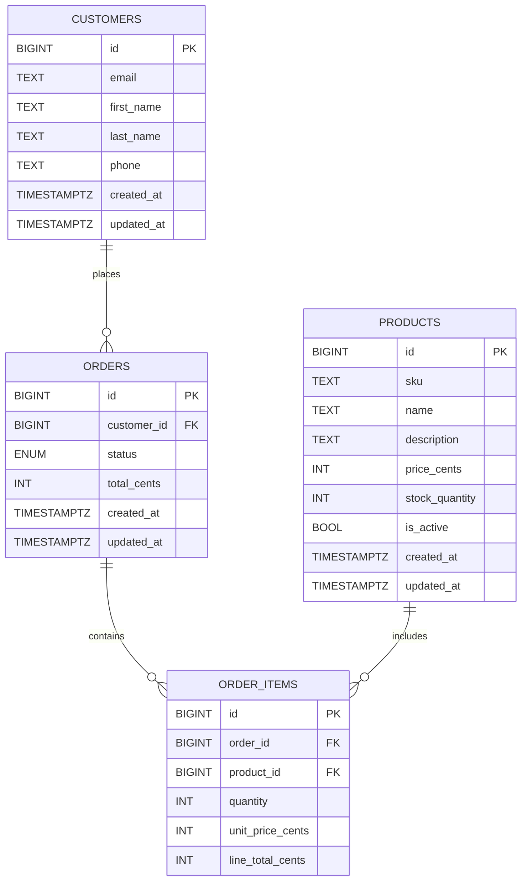

# OMS Design Document

## Architecture Overview
This implementation is a single FastAPI service with a PostgreSQL database. It uses row-level locks and transactions to ensure inventory and order consistency under concurrency. This is a pragmatic baseline that meets the requirements and is easy to evolve.

If scaled into microservices, a reasonable split is:
- Orders Service: order lifecycle and status transitions.
- Inventory Service: product catalog + stock reservations.
- Customers Service: customer profile + history.
- Reporting Service: read-optimized queries and aggregates.

In a microservices version, each service owns its database, and an event bus (e.g., Kafka) propagates order/inventory events. An outbox pattern would ensure reliable event publishing without losing updates.

## Order Status Flow
Allowed transitions:
- `PENDING -> CONFIRMED` or `CANCELLED`
- `CONFIRMED -> SHIPPED` or `CANCELLED`
- `SHIPPED -> DELIVERED`
- `DELIVERED` terminal
- `CANCELLED` terminal

Edits to order items are only allowed while `PENDING`. Cancelling a `PENDING` or `CONFIRMED` order restores inventory.

## Data Model (ER Diagram)

## Consistency & Concurrency
- Inventory changes use `SELECT ... FOR UPDATE` and a single transaction.
- Order creation and edits are transactional: check stock, write order/items, and update stock together.
- Cancelling a `PENDING` or `CONFIRMED` order restores stock within the same transaction.

## Indexing
- `customers(email)` for lookup.
- `products(sku)` for lookup.
- `orders(customer_id, created_at)` for history.
- `orders(created_at)` for date range queries.
- `orders(status, created_at)` for status-filtered reporting.
- `order_items(order_id)` and `order_items(product_id)` for joins.

## Scalability and Maintainability Rationale
- Single service is easiest to reason about and meets the assignment goals.
- Clear boundaries in code (`customers.py`, `products.py`, `orders.py`) ease future split into microservices.
- Transactional integrity and stock locking keep inventory accurate under concurrent orders.
